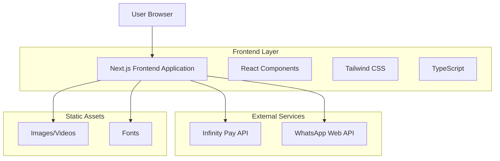

# Documento de Arquitetura Técnica - Landing Page Ricardo Team

## 1. Architecture design



## 2. Technology Description

* Frontend: Next.js\@15.3.3 + React\@19 + TypeScript\@5 + Tailwind CSS\@4

* Build Tool: Next.js com Turbopack para desenvolvimento rápido

* Styling: Tailwind CSS 4 para design responsivo e moderno

* Icons: Lucide React para ícones consistentes

* External APIs: Infinity Pay para pagamentos, WhatsApp Web para contato direto

## 3. Route definitions

| Route | Purpose                                                                                                    |
| ----- | ---------------------------------------------------------------------------------------------------------- |
| /     | Landing page principal com todas as seções (hero, sobre, treinos, depoimentos, preços, pagamento, contato) |

## 4. API definitions

### 4.1 External APIs

**Infinity Pay Integration**

```
POST https://api.infinitypay.io/v1/payments
```

Request:

| Param Name  | Param Type | isRequired | Description                     |
| ----------- | ---------- | ---------- | ------------------------------- |
| amount      | number     | true       | Valor do pagamento em centavos  |
| currency    | string     | true       | Moeda (BRL)                     |
| customer    | object     | true       | Dados do cliente                |
| description | string     | true       | Descrição do serviço contratado |

Response:

| Param Name   | Param Type | Description                            |
| ------------ | ---------- | -------------------------------------- |
| payment\_url | string     | URL para redirecionamento do pagamento |
| payment\_id  | string     | ID único do pagamento                  |
| status       | string     | Status do pagamento                    |

**WhatsApp Web Integration**

```
GET https://wa.me/{phone_number}?text={encoded_message}
```

Parameters:

| Param Name       | Param Type | Description                                           |
| ---------------- | ---------- | ----------------------------------------------------- |
| phone\_number    | string     | Número do WhatsApp do Ricardo (formato internacional) |
| encoded\_message | string     | Mensagem pré-definida codificada em URL               |

## 5. Data model

### 5.1 Data model definition

Como esta é uma landing page estática, não há necessidade de banco de dados. Os dados são gerenciados através de:

* **Configurações estáticas**: Informações do Ricardo Team, tipos de treinos, preços

* **Estado local**: Formulários de contato e seleção de planos

* **APIs externas**: Processamento de pagamentos e redirecionamento WhatsApp

### 5.2 TypeScript Interfaces

```typescript
// Tipos de treinos oferecidos
interface TrainingType {
  id: string;
  name: string;
  description: string;
  icon: string;
  benefits: string[];
}

// Planos de treino
interface TrainingPlan {
  id: string;
  name: string;
  price: number;
  duration: string;
  features: string[];
  highlighted?: boolean;
}

// Depoimentos de clientes
interface Testimonial {
  id: string;
  name: string;
  photo: string;
  text: string;
  result: string;
}

// Dados para pagamento
interface PaymentData {
  planId: string;
  customerName: string;
  customerEmail: string;
  customerPhone: string;
  amount: number;
}

// Configuração do WhatsApp
interface WhatsAppConfig {
  phoneNumber: string;
  defaultMessage: string;
}
```

