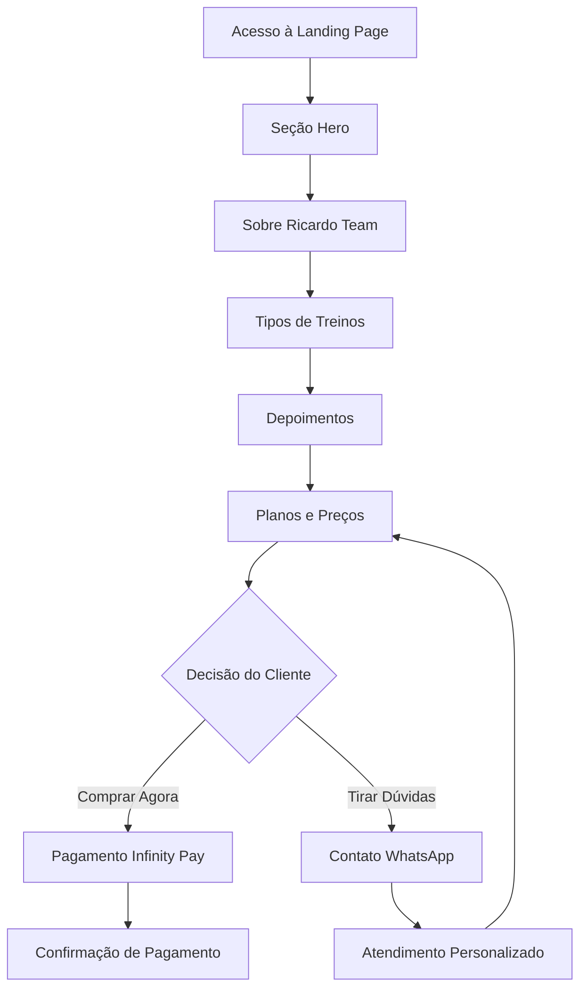

# Documento de Requisitos do Produto - Landing Page Ricardo Team

## 1. Product Overview
Landing Page profissional para apresentação dos serviços de personal trainer do professor Ricardo e sua equipe (Ricardo Team), focada em conversão de leads e vendas de treinos personalizados.
- Soluciona a necessidade de apresentar de forma profissional os serviços de personal training, facilitando o contato direto com clientes e processamento de pagamentos online.
- Direcionada para pessoas interessadas em treinos personalizados de academia, com foco em resultados específicos como emagrecimento, ganho de força e hipertrofia muscular.

## 2. Core Features

### 2.1 User Roles
Não há necessidade de distinção de papéis de usuário para esta landing page, pois é focada em visitantes que se tornarão leads/clientes.

### 2.2 Feature Module
Nossa landing page consiste nas seguintes páginas principais:
1. **Página Principal**: seção hero, apresentação do Ricardo Team, tipos de treinos oferecidos, depoimentos, área de pagamento e contato via WhatsApp.

### 2.3 Page Details

| Page Name | Module Name | Feature description |
|-----------|-------------|---------------------|
| Página Principal | Seção Hero | Apresenta o Ricardo Team com call-to-action principal, imagem impactante e proposta de valor clara |
| Página Principal | Sobre Ricardo Team | Apresenta o professor Ricardo, sua experiência, certificações e filosofia de trabalho |
| Página Principal | Tipos de Treinos | Exibe os diferentes tipos de treinos oferecidos (emagrecimento, força, musculação, funcional) com descrições e benefícios |
| Página Principal | Depoimentos | Mostra resultados e feedbacks de clientes satisfeitos com fotos antes/depois |
| Página Principal | Planos e Preços | Apresenta os diferentes pacotes de treino com preços e benefícios inclusos |
| Página Principal | Área de Pagamento | Integração com Infinity Pay para processamento seguro de pagamentos online |
| Página Principal | Contato WhatsApp | Botão flutuante e seção de contato direto via WhatsApp para esclarecimento de dúvidas |
| Página Principal | Rodapé | Informações de contato, redes sociais e informações legais |

## 3. Core Process
O fluxo principal do usuário na landing page segue uma jornada de conversão linear:

1. **Descoberta**: Usuário acessa a página e visualiza a seção hero com proposta de valor
2. **Interesse**: Navega pelas seções conhecendo Ricardo Team e tipos de treinos
3. **Consideração**: Analisa depoimentos e resultados de outros clientes
4. **Decisão**: Escolhe um plano na seção de preços
5. **Ação**: Realiza pagamento via Infinity Pay ou entra em contato via WhatsApp
6. **Suporte**: Utiliza WhatsApp para esclarecimento de dúvidas durante todo o processo

## 4. User Interface Design

### 4.1 Design Style
- **Cores Primárias**: Laranja vibrante (#FF6B35) e preto (#1A1A1A) para transmitir energia e profissionalismo
- **Cores Secundárias**: Branco (#FFFFFF) e cinza claro (#F5F5F5) para contraste e legibilidade
- **Estilo de Botões**: Botões arredondados com gradiente laranja, efeito hover e sombras suaves
- **Fontes**: Inter para títulos (peso 700-800) e Roboto para textos (peso 400-500), tamanhos responsivos
- **Layout**: Design moderno com cards, seções bem definidas e navegação sticky no topo
- **Ícones**: Ícones minimalistas do Lucide React, com estilo fitness/academia (halteres, músculos, cronômetro)

### 4.2 Page Design Overview

| Page Name | Module Name | UI Elements |
|-----------|-------------|-------------|
| Página Principal | Seção Hero | Background com imagem de academia, título impactante em branco, subtítulo explicativo, botão CTA laranja grande, overlay escuro para legibilidade |
| Página Principal | Sobre Ricardo Team | Layout em duas colunas, foto profissional do Ricardo à esquerda, texto descritivo à direita, badges de certificações, cores neutras com acentos laranja |
| Página Principal | Tipos de Treinos | Grid responsivo de cards, ícones representativos para cada tipo, títulos em negrito, descrições concisas, hover effects com elevação |
| Página Principal | Depoimentos | Carousel de cards com fotos dos clientes, aspas estilizadas, texto em itálico, sistema de navegação por pontos |
| Página Principal | Planos e Preços | Cards de preços com destaque para plano recomendado, lista de benefícios com checkmarks, botões de ação diferenciados |
| Página Principal | Área de Pagamento | Modal ou seção dedicada com formulário limpo, logo Infinity Pay, campos organizados, validação visual |
| Página Principal | Contato WhatsApp | Botão flutuante verde WhatsApp no canto inferior direito, ícone oficial, animação sutil de pulse |

### 4.3 Responsiveness
A landing page é mobile-first com adaptação completa para desktop, incluindo otimização para touch em dispositivos móveis, navegação por gestos e carregamento otimizado de imagens.